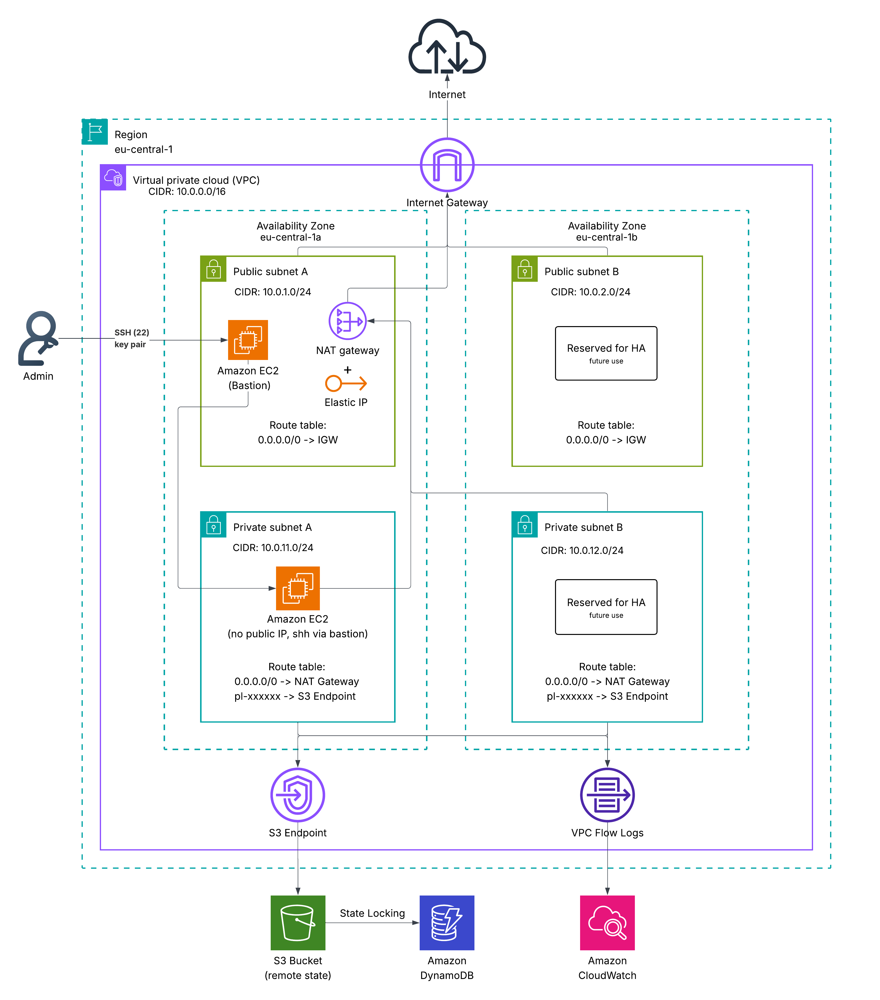

# AWS VPC Infrastructure with Terraform


A production-like AWS VPC environment built with Terraform, demonstrating Infrastructure as Code best practices and AWS networking fundamentals.

## Table of Contents

- [Project Overview](#project-overview)
- [Architecture](#architecture)
- [Prerequisites](#prerequisites)
- [Project Structure](#project-structure)
- [Terraform Deployment](#terraform-deployment)
- [Outputs](#outputs)
- [Technical Documentation](#technical-documentation)
- [Future Improvements](#future-improvements)
- [Key Takeaways](#key-takeaways)


## Project Overview

This project provisions a multi-AZ AWS VPC environment using Terraform.

The infrastructure is built incrementally through four development sprints, simulating how real infrastructure evolves in a team environment — starting from a minimal networking setup and gradually introducing production-grade practices.

**What this project covers:**

- Multi-AZ VPC with public and private subnet segmentation
- Bastion-based SSH access to private resources
- NAT Gateway for controlled outbound internet access from private subnets
- S3 Gateway Endpoint to keep AWS traffic off the public internet
- Modular Terraform architecture with remote state and locking
- VPC Flow Logs with CloudWatch integration
- EC2 compute layer for end-to-end connectivity validation


## Architecture

The infrastructure spans two Availability Zones and separates public and private workloads.



**Traffic flow summary:**

| Flow | Path |
|---|---|
| Inbound admin access | Internet → IGW → Bastion Host (public subnet) |
| Internal access | Bastion → Private EC2 (via Security Group referencing) |
| Outbound from private | Private EC2 → NAT Gateway → Internet |
| AWS internal traffic | Private EC2 → S3 Gateway Endpoint → S3 |

> Full networking design, security model, CIDR layout, and per-sprint implementation
> details are documented in the [Technical Documentation](#technical-documentation) below.


## Prerequisites

Before deploying this infrastructure, ensure you have the following installed and configured:

- [Terraform](https://developer.hashicorp.com/terraform/install) `>= 1.5.0`
- AWS CLI configured with appropriate credentials
- An AWS account with permissions to create VPC, EC2, IAM, and CloudWatch resources
- An S3 bucket and DynamoDB table for remote state (created via `bootstrap/`)


## Project Structure
```text
terraform-aws-vpc-project
│
├── bootstrap/              # Minimal bootstrap configuration for backend resources
├── diagrams/               # Architecture diagrams used in the documentation
├── docs/                   # Sprint-based project documentation
├── modules/                # Reusable Terraform modules for infrastructure components
│   ├── compute/            # EC2 resources for bastion and private instance validation
│   ├── endpoints/          # VPC endpoints configuration (for example S3 Gateway Endpoint)
│   ├── observability/      # Flow Logs, CloudWatch Logs, and related IAM resources
│   ├── routing/            # Route tables, route associations, Internet/NAT routing
│   ├── security/           # Security Groups for web, app, bastion, and private access
│   ├── subnets/            # Public and private subnet definitions across Availability Zones
│   └── vpc/                # Core VPC resource and base network configuration
│
├── .gitignore              # Files and directories excluded from version control
├── .terraform.lock.hcl     # Provider dependency lock file
├── backend.tf              # Remote backend configuration for Terraform state
├── data.tf                 # Data sources used by the configuration
├── main.tf                 # Root module orchestration and module composition
├── outputs.tf              # Exported values from the infrastructure
├── provider.tf             # Terraform provider configuration
├── README.md               # Main project documentation
├── terraform.tfvars        # Input variable values for the environment
└── variables.tf            # Input variable definitions for the root module
```


## Terraform Deployment

### 1. Bootstrap remote state (first time only)
```bash
cd bootstrap
terraform init
terraform apply
```

### 2. Configure variables
```bash
cp terraform.tfvars.example terraform.tfvars
# edit terraform.tfvars with your values
```

### 3. Deploy infrastructure
```bash
terraform init
terraform validate
terraform plan
terraform apply
```

### 4. Destroy infrastructure
```bash
terraform destroy
```


## Outputs

After deployment, Terraform exposes the following values:

| Output | Description |
|---|---|
| `vpc_id` | ID of the created VPC |
| `public_subnet_a_id` | ID of public subnet in AZ-a |
| `public_subnet_b_id` | ID of public subnet in AZ-b |
| `private_subnet_a_id` | ID of private subnet in AZ-a |
| `private_subnet_b_id` | ID of private subnet in AZ-b |


## Technical Documentation

The full technical documentation is split across four sprint docs — each covering
the design decisions and architecture changes introduced at that stage.
If you want to understand how and why the infrastructure was built, start there.

| Sprint | Focus | Key additions |
|---|---|---|
| [Sprint 01](docs/sprints/sprint-01-network-foundation.md) | Networking Foundation | VPC, subnets, IGW, route tables, Security Groups |
| [Sprint 02](docs/sprints/sprint-02-terraform-refactor.md) | Terraform Refactor | Modules, S3 remote state, DynamoDB locking |
| [Sprint 03](docs/sprints/sprint-03-advanced-networking.md) | Advanced Networking | NAT Gateway, VPC Flow Logs, S3 Endpoint |
| [Sprint 04](docs/sprints/sprint-04-compute-layer-validation.md) | Compute & Validation | Bastion host, private EC2, connectivity tests |


## Future Improvements

- Application Load Balancer with multi-AZ routing
- Auto Scaling Groups for compute workloads
- ECS or containerized workloads
- CI/CD pipeline for Terraform deployments (`terraform fmt`, `validate`, `plan` on PR)
- Multi-environment support (dev / staging / prod)


## Key Takeaways

This project demonstrates not only how to provision AWS infrastructure, but how
to design and evolve it with a production mindset.

- Multi-layer AWS networking with clear public/private separation
- Security Group referencing instead of open CIDR rules for internal communication
- Modular Terraform design with remote state and locking
- Safe state migration after structural refactoring (`terraform state mv`)
- Controlled outbound connectivity using NAT Gateway
- Internal AWS traffic optimization using VPC Gateway Endpoints
- End-to-end connectivity validation through real SSH and network flow scenarios
- Network observability using VPC Flow Logs and CloudWatch
- Incremental infrastructure development — each sprint leaves the system in a
  testable state

---

[⬆ Back to top](#aws-vpc-infrastructure-with-terraform)