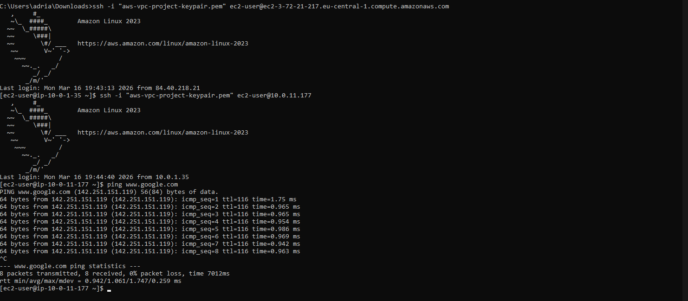
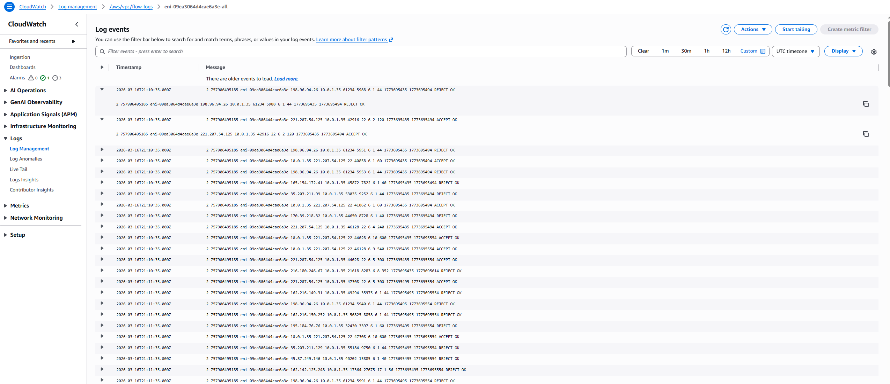

[← Previous: Sprint-03 Advanced Networking](sprint-03-advanced-networking.md)  
[Back to README](../../README.md)  

# Sprint 04 — Compute Layer and Connectivity Validation

## Overview

The goal of Sprint 04 was to deploy the compute layer and use it to validate
that all networking and security configurations implemented in previous sprints
work correctly in a real access scenario.

This sprint introduced EC2 instances into the VPC and confirmed end-to-end
connectivity through a sequence of practical tests.


## Objectives

- Deploy a Bastion Host in the public subnet as the single entry point for
  administrative access
- Deploy a private EC2 instance accessible only through the bastion
- Validate SSH connectivity through the bastion to the private instance
- Confirm outbound internet access from the private subnet via NAT Gateway
- Verify basic observability using CloudWatch Logs


## Infrastructure Components

| Resource | Module | Description |
|---|---|---|
| `aws_instance` (bastion) | `compute` | Public-facing host for administrative SSH access |
| `aws_instance` (private) | `compute` | Internal host for connectivity validation |
| `aws_security_group` (bastion-sg) | `security` | Allows SSH inbound from the internet |
| `aws_security_group` (private-test-sg) | `security` | Allows SSH only from `bastion-sg` |


## Module Structure After Sprint 04

One new module was introduced:
```text
modules/
│
├── vpc/
├── subnets/
├── routing/
├── security/         # Extended: + bastion-sg, private-test-sg
├── endpoints/
├── observability/
└── compute/          # New: Bastion Host, Private EC2
```


## Architecture

The compute layer follows a standard AWS security pattern — the bastion host
is the only instance exposed to the internet. Private instances have no public
IP address and are reachable only through the bastion.
```
Internet
    │
    ▼
Bastion Host (public subnet, public IP)
    │
    ▼
Private EC2 (private subnet, no public IP)
    │
    ▼
Internet via NAT Gateway (outbound only)
```


## Bastion Host

The bastion host is deployed in the public subnet and assigned a public IP
address automatically. It acts as the single controlled entry point for
administrative access to private resources — reducing the attack surface by
ensuring no private instance is ever directly reachable from the internet.

Security Group: `bastion-sg`

| Direction | Protocol | Port | Source |
|---|---|---|---|
| Inbound | TCP | 22 | 0.0.0.0/0 |
| Outbound | All | All | 0.0.0.0/0 |

> In a production environment SSH access would be restricted to a known
> administrator IP rather than `0.0.0.0/0`, or replaced entirely with
> AWS Systems Manager Session Manager to eliminate the need for open SSH ports.


## Private EC2 Instance

The private instance is deployed in the private subnet with no public IP address.
It is not reachable from the internet directly — SSH access is only possible
through the bastion host.

Security Group: `private-test-sg`

| Direction | Protocol | Port | Source |
|---|---|---|---|
| Inbound | TCP | 22 | `bastion-sg` |
| Outbound | All | All | 0.0.0.0/0 |

`private-test-sg` references `bastion-sg` directly — only connections
originating from the bastion host are accepted.


## Connectivity Validation

The infrastructure was validated through a sequence of three tests.

### 1. Bastion Host Access

SSH access from the local machine to the bastion host was verified.
```bash
ssh -i aws-vpc-project-keypair.pem ec2-user@<bastion-public-ip>
```

Successful login confirms:

- Internet Gateway routing is working
- `bastion-sg` allows inbound SSH
- Public subnet configuration is correct

---

### 2. Bastion to Private Instance Access

From inside the bastion host, SSH access to the private instance was verified.
```bash
ssh -i aws-vpc-project-keypair.pem ec2-user@<private-instance-ip>
```

Successful login confirms:

- Security Group referencing between `bastion-sg` and `private-test-sg` works
- Private subnet routing is correct
- Internal VPC communication is functioning

---

### 3. Outbound Internet Access from Private Subnet

From inside the private instance, outbound internet connectivity was verified.
```bash
ping www.google.com
```

Successful responses confirm:

- Private route table correctly directs traffic to the NAT Gateway
- NAT Gateway provides outbound internet access for private instances
- The full outbound traffic path is functioning end-to-end


## Observability

CloudWatch Logs were checked to confirm that instance activity was being
captured and that the monitoring setup introduced in Sprint 03 is operational.

Log streams were visible in the `/aws/vpc/flow-logs` log group, showing
network traffic generated during the connectivity tests — including the SSH
sessions and outbound ping traffic.


## Validation Evidence

The following screenshots were captured as proof of successful infrastructure
validation.

### Connectivity Test


Demonstrates SSH access to the bastion, SSH access from the bastion to the
private instance, and successful outbound internet connectivity from the
private subnet.

### CloudWatch Logs


Confirms that deployed instances are generating log data and that network
observability is operational.


## Key Takeaways

- The bastion pattern reduces attack surface by ensuring private instances
  are never directly exposed to the internet
- Security Group referencing between `bastion-sg` and `private-test-sg`
  enforces that the only path into the private instance is through the bastion
- Successful `ping` from the private instance confirms the entire outbound
  path — private route table, NAT Gateway, and Internet Gateway — is working
  correctly
- VPC Flow Logs provided immediate value during validation, making it possible
  to observe and confirm traffic patterns without additional tooling
- Deploying compute last and using it purely for validation is a clean approach —
  infrastructure is proven to work before any application layer is added


## Project Complete

This sprint completes the core infrastructure build. All four layers have been
deployed and validated:

| Layer | Sprint | Status |
|---|---|---|
| Networking foundation | Sprint 01 | ✓ |
| Terraform refactor and remote state | Sprint 02 | ✓ |
| Advanced networking | Sprint 03 | ✓ |
| Compute layer and validation | Sprint 04 | ✓ |

Future improvements are tracked in the [README](../../README.md#future-improvements).

[⬆ Back to top](#sprint-04--compute-layer-and-connectivity-validation)

---
[← Previous: Sprint-03 Advanced Networking](sprint-03-advanced-networking.md)  
[Back to README](../../README.md)  